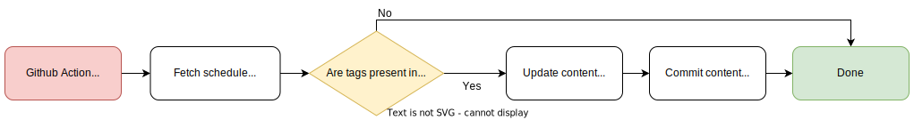

# Schedule update action
This GitHub action provides the functionality to:
- Automatically fetch events from a given TimeEdit calendar and
output the calendar events in a markdown file as formatted markdown content.
- The script places content within a set area indicated by dynamic content tags.  
Should the tags be missing, then no action will be taken.

The following flowchart illustrates the GitHub action workflow.

<div style="text-align: center;">



</div>

## Getting started
A minimal working example could look like the following,
```yml
name: Update TimeEdit schedule

on:
  schedule:
    - cron:  '30 6 * * *'

jobs:

  fetch-timeedit-events:
    runs-on: ubuntu-latest    
    steps:     
      - name: Fetch TimeEdit schedule
      uses: EdmanJohan/schedule-update-action@master
      with:
        timeedit-url: https://cloud.timeedit.net/
        course-name: YOUR_COURSE_NAME
        repo-name: YOUR_REPO_NAME
        repo-owner: YOUR_REPO_OWNER
        repo-file: YOUR_REPO_FILE
        filter-empty: true
        use-kth-places: false
        uses: EdmanJohan/schedule-update-action@master
        with:
          timeedit-url: https://cloud.timeedit.net/kth/web/public01/
          course-name: dd2482
          repo-name: devops-course
          repo-owner: EdmanJohan
          repo-file: README.md
          filter-empty: true
          use-kth-places: true
```

Then, place the following tags in the markdown file to indicate where the  
content should be inserted.

```
<!-- start dynamic schedule content -->
<!-- end dynamic schedule content -->
```
### Inputs
#### `timeedit-url`
**Required** The url of the TimeEdit site to use. E.g. `https://cloud.timeedit.net/kth/web/public01/`  

#### `course-name`
**Required** The name of the course to fetch events for. E.g. `DD2482`
#### `repo-owner`
**Optional** Repository owner where file to update resides. Defaults to current context.

#### `repo-name`
**Optional** Repository name where file to update resides. Defaults to current context.

#### `repo-file`
**Optional** Full name of file to update. Defaults to `README.md`.

#### `token`
**Required** GitHub token to interact with API. Default `github.token`

#### `filter-empty`
**Optional** Boolean value to indicate whether empty events should be filtered. Default `true`

#### `use-kth-places`
**Optional** Boolean value to indicate whether to replace locations with KTH Places links. Default `false´

### External Packages
The GitHub aciton utilizies the [simple-timeedit-api](https://www.npmjs.com/package/simple-timeedit-api) package, that was developed in conjunction with this.

The source code is available in the corresponding [repository](https://github.com/EdmanJohan/TimeEditAPI).
    
### Limitations  
Due to the fact that TimeEdit deletes events that have passed, and the action  
itself does not maintain memory, old events will simply be deleted as time passes.
